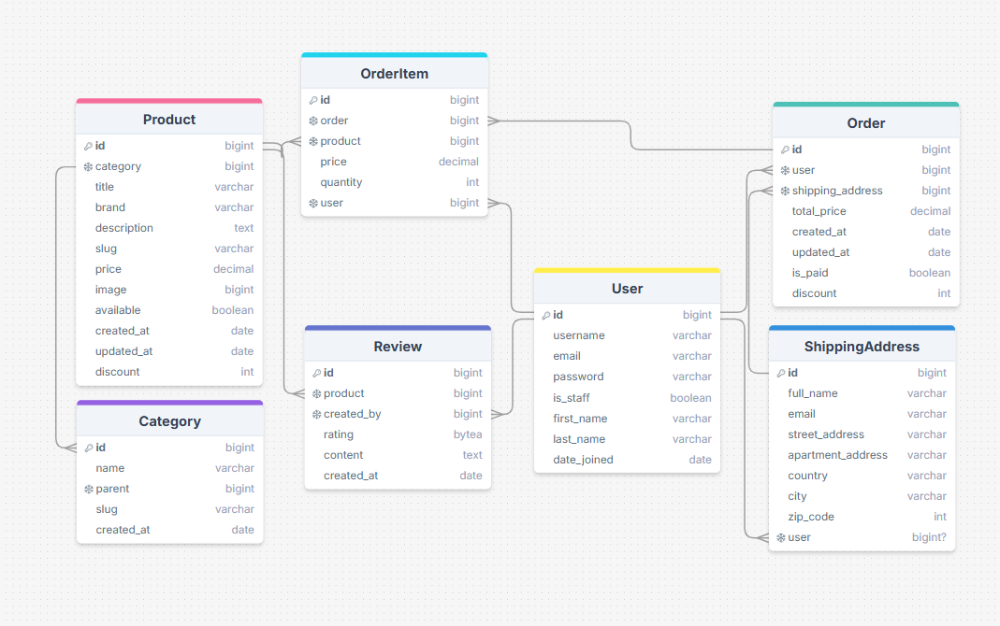
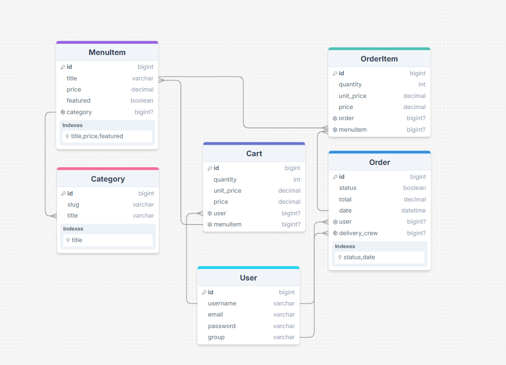

# Technical Requirements (E-Commerce Backend API)

Russian Title: `Техническое задание для студентов на Интернет Магазин Проект на Голанге`

There is 2 teams, for each 3 students and 1 mentor:

---

**@dotpep, (github_link) Mentor - 3 students:**

- @, Максим (github_link), core service
- @, Нуртай (github_link), auth/user service
- @, Артем (github_link), scraper service

---

**@alfinky, (github_link) Mentor - 3 students:**

- @, Жанболат (github_link), core service
- @, Ергали (github_link), auth/user service
- @, Бексултан (github_link), scraper service

---

Main goals of this project is to mentor.

## Table of Content

## TO DO for Mentors

- [ ] write Table of content
- [ ] additional Technical Requirements
- [ ] structure Boilerplate and Architectural dirs
- [ ] how it will be implemented, think about logic of User Group/Role Management, in User-Auth-Service (or it need like another separated service)

## Principles and Rules

- Write and Cover your service with Unit Tests.
- Write Documentation on `services/your-service/README.md`, and also provide other materials in `docs/service-name/something_to_document`.
- Write good Commit messages.
- English Only!
- Stick With Good Programming Principles/Practices below:

**Programming Principles:**

- Clean Code and Clean Architecture
- SOLID
- DRY
- KISS
- YAGNI
- Naming Convention

## E-Commerce Microservices

More information given in: `services/README.md`.

---

**Base services:**

- User Auth service
- Core Shop service
- Scraper and AI service

---

**Additional services:**

- Payment system/service
- Notification system/service
- Divide Core-Shop-Service into smallest services

---

**Additional Components/Features:**

- Docker Containerization and Docker Compose
- CI/CD Pipeline
- Centralized Logging system (ELK), Monitoring
- API Gateway, gRPC API
- RabbitMQ - Message Broker, Celery - Task Queue
- K8s Container Orchestration

## Tech Stack

- Golang
- Communcation between Services will be using RESTful API (in the future gRPC)
- `Gin` for API, `Colly` for Scraping, `OpenAI/Or other` for Filtering Scraped Product from other E-Shops.
- Communication with Databases (use whetever libs, methods you want, ORMs or Raw SQL query)
- PostgreSQL for `Core-Shop-Service`
- MongoDB or PostgreSQL for `User-Auth-Service`
- Cache Redis for `User-Authentication` in `User-Auth-Service` expiration session, `User-OrderItem-Bucket`/`OrderItem`/`Bucket` in `Core-Shop-Service` and etc.
- JWT for Authentication/Authorization

---

**Required:**

- RESTful API (required)
- Databases (required)
- Unit Testing (required)

---

**For Future:**

- Docker containers, Docker Compose and CI/CD Pipeline (for future)
- gRPC and API Gateway (for future)
- Logging and Monitoring, ELK stack (for future)
- RabbitMQ, Celery (for future)
- K8s (for future)

## Some Explanation for Students

- Check `services/README.md`, there is Technical Requirements for each Services.
- You need to delete/cut `.example` name part in your files and make it own/use it.
- Some files like docker-compose.yml, and like api-gateway dir and etc. it's for future. First of all try to use and implement it in your local machine without using Docker and etc.
- You should work only on your provided service `services/your-service/` directory.
- Write documentation only in `docs/service-name/something_to_document`.
- Write Unit Tests in `services/your-service/tests/`. (delete `unit_tests.here.example` file).
- Write Core of your service API/App in `services/your-service/internal/`. (delete `core_of_your_api_service.here.example` file).
- Make Module, `go.mod`, `go.sum`.

---

**Life-cicle:**

`Deadline is 1 month, start date: 26.10.2024, end date: 30.11.2024`

- First step: use `git clone`
- You will just make pull request, with changes in your `services/your-service/`, push it.
- And We Mentors will be `code review` your code and apply or decline.
- Also 1 week 1 meetup, We will make some lections and activities, you will explain your written code, and etc. communication things.
- Students have TODO Tasks in Project Kanban Board assigned from mentor. It will be like 1 task 1 week, with issued in project and assigned to student.
- Mentor cannot write any code!

**ER-D Examples (for Core-Shop-Service):**

E-Commerce ER-D:

---

Restaurant ER-D:

**Links:**

- https://roadmap.sh/projects/ecommerce-api
- https://roadmap.sh/projects/scalable-ecommerce-platform

---

- https://drawsql.app/teams/test-team1-2/diagrams/littlelemonapi
- https://drawsql.app/teams/test-team1-2/diagrams/ecommerce
